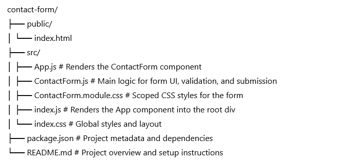

# React Contact Form

This is a simple and clean React-based contact form project. 
The application allows users to input and submit their name, email, phone number, and a message. 
It includes validation logic, modern styling with CSS Modules, and a user-friendly interface.

##  Features

- **React Functional Components** using Hooks (`useState`)
- **Form validation** for name, email, phone (10-digit), and message
- **Phone number pattern validation** (client-side via HTML `pattern`)
- **Live error messages** for user feedback
- **Submission preview** showing the submitted data
- **CSS Modules** for scoped and maintainable styling
- **Responsive layout** using Flexbox

##  Project Structure

## Form Validation Details

The form checks for:
- **Name**: Required
- **Email**: Must include '@'
- **Phone**: Must be exactly 10 digits (validated via regex and input pattern)
- **Message**: Required

If all fields are valid, the data is displayed below the form in a formatted block.

##  Styling

- **Scoped styling** using `ContactForm.module.css`
- Global layout in `index.css`
- Clean, modern, mobile-friendly UI
- Submit button has hover effects

## Technologies Used

- React (via create-react-app)
- JavaScript (ES6+)
- CSS Modules
- HTML5