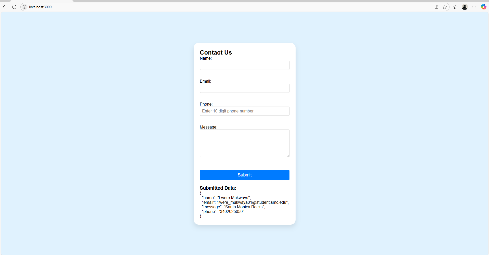

# Project Results

This document summarizes key outcomes and verification steps for the **React Contact Form** project.

---

---
## Project Build

- Created with `npm init` and React setup.
- No compile-time or runtime errors during development.
- Successfully runs with `npm start`, rendering the form in the browser.

---

## Validation Logic

Form validation covers the following cases:

- **Name**: Required (must not be empty)
- **Email**: Must include `@` (basic format check)
- **Phone**: Must be exactly 10 digits (validated via regex and `pattern`)
- **Message**: Required (must not be empty)

When invalid input is detected, error messages appear *inline* under each field.

Once valid data is submitted, it’s cleared from the form and displayed below in formatted JSON.

---

## GitHub Deployment

- Repository URL: `https://github.com/mlwere1977/cs81-module11-form`
- Latest commit message: `"Module 11 Contact Form"`
- Branch: `main` (tracked to `origin/main`)
- All project files present online:  
  `src/ContactForm.js`, `ContactForm.module.css`, `App.js`, `index.js`, `index.css`, and `README.md`

---

## Styling

- Scoped styling using **CSS Modules** for form-related styles.
- Global layout/reset styles in `index.css`.
- Responsive and modern look: centered container, input focus state, button hover effect.

---

##  Manual Check

1. Open the app in the browser.
2. Test submitting the form with missing or invalid fields — error messages display correctly.
3. Fill valid data — form resets and shows submitted data.
4. Inspect stylesheet: ContactForm CSS module correctly applied to component.
5. On GitHub: confirm files are visible and README correctly formatted.

---

## Suggestions

- Add `README` badges (e.g. build, license).
- Add GitHub Actions for CI or form-based testing.
- Extend validation for stronger email formats or phone formatting (e.g. `(123) 456-7890`).
- Deploy to GitHub Pages using `gh-pages` package.

